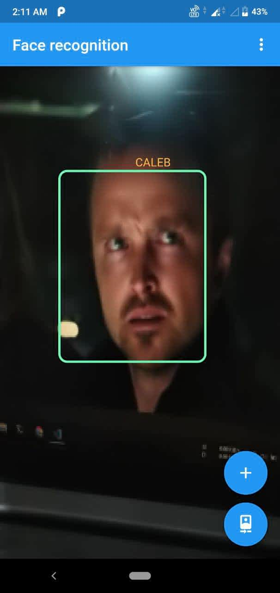
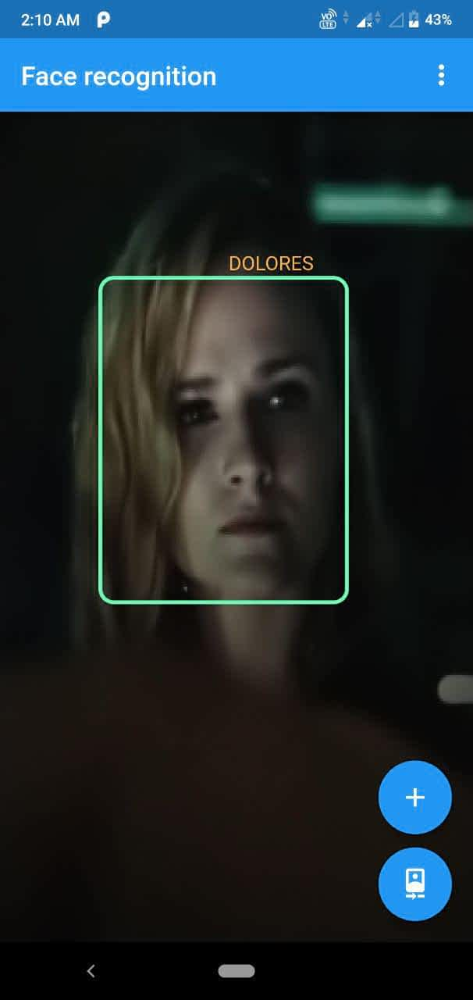

# Face Recognition Flutter

Realtime face recognition flutter app update with latest null safety implementation and the depreceated Firebase ML Vision has been migrated to Google ML Kit.

This base repo has been forked from https://github.com/Rajatkalsotra/Face-Recognition-Flutter.


## Steps

### Face detection

Uses Google ML Kit

### Face Recognition

Convert Tensorflow implementation of [MobileFaceNet](https://github.com/sirius-ai/MobileFaceNet_TF) model into tflite.

## Installing

**Step 1:** Download or clone this repo:

```
git clone https://github.com/rjvysakh/Face-Recognition-Flutter
```

**Step 2:** Go to project root and execute the following command in console to get the required dependencies: 

```
flutter pub get 
```

**Step 3:** Add dynamic libraries for flutter_tflite package to work:

[Follow these instructions](https://pub.dev/packages/tflite_flutter#important-initial-setup)

**Step 4:** Install flutter app

```
flutter run 
```

## Recognitions

(Shots from Westworld )

<p float="left">
  
   
</p>

## Contributing

Contributions are what make the open source community such an amazing place to be learn, inspire, and create. Any contributions you make are **greatly appreciated**.

1. Fork the Project
2. Create your Feature Branch (`git checkout -b feature/AmazingFeature`)
3. Commit your Changes (`git commit -m 'Add some AmazingFeature'`)
4. Push to the Branch (`git push origin feature/AmazingFeature`)
5. Open a Pull Request

## License

Distributed under the MIT License. See `LICENSE` for more information.

## References

1. <https://github.com/sirius-ai/MobileFaceNet_TF>

2. [Mobile Face Net](https://arxiv.org/ftp/arxiv/papers/1804/1804.07573.pdf)
